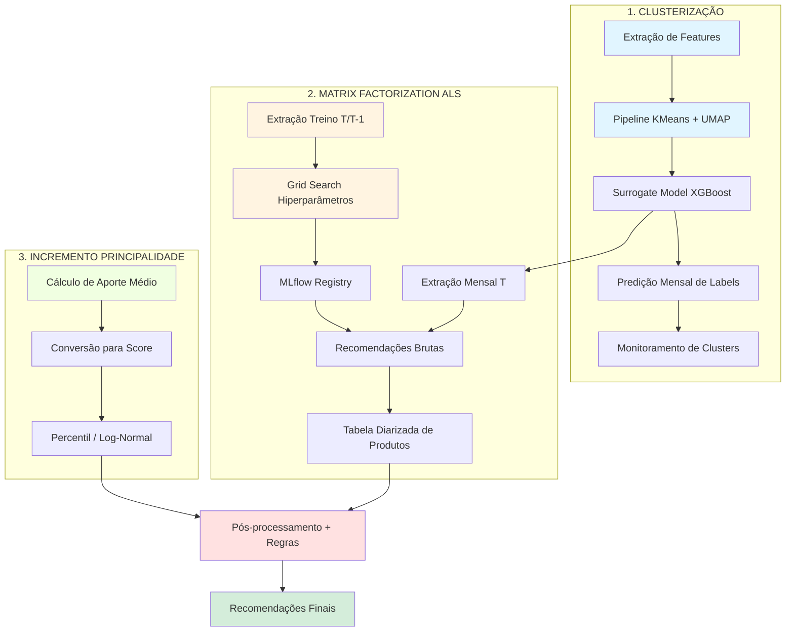
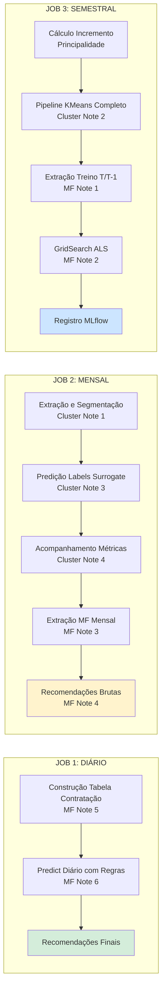
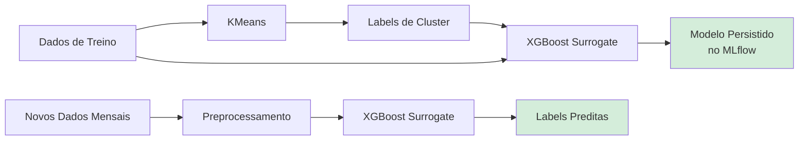

# Sistema de Recomendação Look-alike para Aumento da Principalidade 

## Visão Geral

Este projeto implementa um **sistema de recomendação Look-alike** focado em aumentar a **Principalidade** de associados. A solução utiliza **clusterização não-supervisionada**, **fatoração de matrizes (ALS)** e **modelos de incremento de principalidade** para gerar recomendações personalizadas de produtos financeiros.

O sistema identifica padrões de comportamento entre clientes similares (look-alike) e recomenda produtos que maximizam o potencial de relacionamento bancário, considerando tanto cross-sell (novos produtos) quanto up-sell (aumento de volume em produtos existentes).

---

## Arquitetura do Sistema

O projeto está estruturado em **3 módulos principais** que trabalham em conjunto:



---

## Pipeline de Execução

O sistema opera através de **3 Jobs orquestrados** com frequências distintas:



### Job 1: Diário (Inferência e Regras de Negócio)

**Frequência:** Execução diária  
**Objetivo:** Gerar recomendações personalizadas aplicando regras de negócio e filtros

| Etapa | Notebook | Descrição | Output (Tabela Hive) |
|-------|----------|-----------|----------------------|
| 1 | `MatrixFactorization/5.Tabela_Diarizada.py` | Constrói tabela diarizada de produtos contratados pelo cliente | `int_eng_rel.tb_principalidade_diarizada` |
| 2 | `MatrixFactorization/6.Predict.py` | Aplica pós-processamento: normalização, negativação (remove produtos já contratados), regras de negócio e peso do incremento de principalidade | `int_eng_rel.tb_principalidade_recomendacao_final` |

**Outputs:** Recomendações finais prontas para consumo (diário)

---

### Job 2: Mensal (Scoring e Monitoramento)

**Frequência:** Execução mensal  
**Objetivo:** Atualizar segmentação de clientes e gerar novas recomendações brutas

| Etapa | Notebook | Descrição | Output (Tabela Hive) |
|-------|----------|-----------|----------------------|
| 1 | `Clusterizacao/1.Extração_Segmentacão.py` | Extração de features, tratamento de nulos e criação da ABT (Analytical Base Table) | `int_eng_rel.tb_principalidade_segmentacao_v0` |
| 2 | `Clusterizacao/3.Predicao_Labels.py` | Predição de labels de cluster usando o Surrogate Model (Decision Tree) | `-` (Update in-place) |
| 3 | `Clusterizacao/4.Tabela_Acompanhamento.py` | Monitoramento: média e moda das features por cluster para análise de drift | `int_eng_rel.tb_principalidade_segmentacao_avaliacao` |
| 4 | `MatrixFactorization/3.Extracao_MT_Predict.py` | Extração de dados do mês T para geração de recomendações | `int_eng_rel.tb_principalidade_produtos_predict` |
| 5 | `MatrixFactorization/4.Recomendacao.py` | Geração de recomendações brutas usando hiperparâmetros registrados no MLflow | `int_eng_rel.tb_principalidade_recomendacao_bruta` |

**Outputs:** Novas predições de cluster + Recomendações brutas mensais

---

### Job 3: Semestral (Retreino Completo)

**Frequência:** Execução semestral  
**Objetivo:** Retreinar todos os modelos do zero com dados atualizados

| Etapa | Notebook | Descrição | Output (Tabela Hive) |
|-------|----------|-----------|----------------------|
| 1 | `Incremento_Principalidade/Percentil.py`<br/>`Incremento_Principalidade/LogNormal.py` | Cálculo do incremento de principalidade: previsão de aporte médio convertido em score | `int_eng_rel.tb_principalidade_produtos_score` |
| 2 | `Clusterizacao/2.Pipeline_Kmeans.py` | Pipeline completo: KMeans + UMAP + Treinamento do Surrogate Model (XGBoost) para aprender regras dos clusters | `-` (Modelo no MLflow) |
| 3 | `MatrixFactorization/1.Extracao_MT_Treino.py` | **Extração crítica:** Dados dos meses T e T-1, remove transições de cluster para criar ground truth limpo | `int_eng_rel.tb_principalidade_produtos_treino` |
| 4 | `MatrixFactorization/2.Treino_MT.py` | Grid Search de hiperparâmetros do ALS por cluster. Métricas: NDCG@K, MAP@K, Hit Rate. Registro no MLflow | `-` (Métricas no MLflow) |

**Outputs:** Modelos retreinados + Hiperparâmetros otimizados registrados no MLflow

---

## Estrutura de Diretórios

```
.
├── Clusterizacao/                          # Módulo 1: Segmentação de Clientes
│   ├── 1.Extração_Segmentacão.py          # Extração de features + Tratamento de nulos
│   ├── 2.Pipeline_Kmeans.py                # KMeans + UMAP + Surrogate Model (XGBoost)
│   ├── 3.Predicao_Labels.py                # Predição mensal via Surrogate Model
│   └── 4.Tabela_Acompanhamento.py          # Monitoramento de drift (média/moda por cluster)
│
├── MatrixFactorization/                     # Módulo 2: Recomendações ALS
│   ├── 1.Extracao_MT_Treino.py             # Extração T/T-1 (remove transições de cluster)
│   ├── 2.Treino_MT.py                       # Grid Search + MLflow tracking
│   ├── 3.Extracao_MT_Predict.py             # Extração mensal (apenas mês T)
│   ├── 4.Recomendacao.py                    # Geração de recomendações brutas
│   ├── 5.Tabela_Diarizada.py                # Construção tabela de produtos contratados
│   ├── 6.Predict.py                         # Pós-processamento + Regras de negócio
│   └── utils.py                             # Funções auxiliares (métricas, UDFs, etc)
│
└── Incremento_Principalidade/               # Módulo 3: Score de Principalidade
    ├── Percentil.py                         # Abordagem baseada em percentis
    └── LogNormal.py                         # Abordagem baseada em distribuição log-normal
```

---

## Tech Stack

### Algoritmos e Modelos

| Componente | Algoritmo | Biblioteca | Objetivo |
|------------|-----------|------------|----------|
| **Clusterização** | KMeans | `scikit-learn` | Segmentação de clientes em grupos homogêneos |
| **Redução de Dimensionalidade** | UMAP | `umap-learn` | Projeção de features para espaço latente (30D) |
| **Surrogate Model** | XGBoost (Multiclass) | `xgboost` | Aprender regras dos clusters para predição futura |
| **Recomendação** | ALS (Alternating Least Squares) | `pyspark.ml` | Matrix Factorization para recomendações implícitas/explícitas |
| **Incremento Principalidade** | Regressão Log-Normal / Percentil | `numpy`, `pandas` | Conversão de aporte médio em score de principalidade |

### Interpretabilidade e Validação
- **SHAP**: Interpretação das features mais importantes por cluster
- **Cross-Validation**: Stratified K-Fold (5 splits) para validação do Surrogate Model
- **Métricas de Ranking**: NDCG@K, MAP@K, Precision@K, Recall@K, Hit Rate

---

## Detalhes de Implementação

### Engenharia de Features e Pipeline (Clusterização)

#### Contexto Técnico

A segmentação look-alike busca dividir os associados PF em grupos de similaridade baseados em características inerentes, como dados sociodemográficos e atributos qualificadores. O objetivo é criar grupos heterogêneos em nível de engajamento, permitindo que a etapa de recomendação (ALS) encontre os produtos mais adequados para cada perfil.

As variáveis são provenientes da CIA (`sicredi_cas.exp_cia`) e passam por transformações para redução de dimensionalidade focada na preservação de distâncias locais.

#### Dicionário de Variáveis

| Variável | Tipo | Origem (Tabela CIA) |
|----------|------|---------------------|
| `VLR_RENDA_MENSAL_AJUSTADA` | Numérica | `perfil_sociodemografico` |
| `MESES_DESDE_ASSOCIACAO` | Numérica | `indicador_principalidade` |
| `NUM_IF_EXT_M12` | Numérica | `perfil_if` |
| `IDH` | Numérica | `perfil_sociodemografico` |
| `POP_2022` | Numérica | `perfil_sociodemografico` |
| `PIB_PER_CAPITA` | Numérica | `perfil_sociodemografico` |
| `TOTAL_VALOR_CARTAO_MERCADO_SCR` | Numérica | `indicador_principalidade` |
| `VLR_CAPITAL_SOCIAL` | Numérica | `indicador_principalidade` |
| `SCORE_ONLINE_SUBSCRIPTIONS` | Numérica | `perfil_consumo` |
| `SCORE_PET_LOVER` | Numérica | `perfil_consumo` |
| `SCORE_CAR_OWNER` | Numérica | `perfil_consumo` |
| `SCORE_HOUSE_CARE` | Numérica | `perfil_consumo` |
| `POSSUI_VEICULO_COM_CERTEZA` | Binária | `bens_proprios_veiculos` |
| `POSSUI_IMOVEL_COM_CERTEZA` | Binária | `bens_proprios_imoveis` |
| `FLG_EXCLUSIVIDADE_SICREDI` | Binária | `perfil_sociodemografico` |
| `OCUPACAO_GRANDE_GRUPO` | Categórica | `perfil_sociodemografico` |
| `PERFIL_EXT_M3` | Categórica | `perfil_if` |
| `DES_ESTADO_CIVIL` | Categórica | `perfil_sociodemografico` |
| `NIVEL_RISCO` | Ordinal | `mod_margem_projetada` |
| `BUCKET` | Ordinal | `perfil_rentabilizacao` |
| `PORTE_PADRAO` | Ordinal | `indicador_principalidade` |
| `CAT_ESTAGIO_VIDA` | Ordinal | `perfil_sociodemografico` |

**Total:** 22 features (12 numéricas, 3 binárias, 3 categóricas, 4 ordinais)

#### Pipeline de Transformação

O pipeline é implementado via `scikit-learn.ColumnTransformer` com tratamentos específicos por tipo de dado:

| Etapa | Método/Técnica | Detalhe Técnico |
|-------|----------------|-----------------|
| **1. Tratamento de Nulos** | Imputação por Grupo | - **Numéricos:** Mediana por `PORTE_PADRAO` (renda) ou `COD_COOP` (IDH, POP, PIB) <br>- **Ordinais:** Moda por `PORTE_PADRAO` (`NIVEL_RISCO`, `BUCKET`) <br>- **Categóricos:** Imputação lógica (ex: `PERFIL_EXT_M3 = "SEM_RELAC_EXTERNO"` quando `NUM_IF_EXT_M12 = 0`) |
| **2. Transformação Logarítmica** | `LogTransformer` (log1p) | Aplicado em: `VLR_RENDA_MENSAL_AJUSTADA`, `MESES_DESDE_ASSOCIACAO`, `NUM_IF_EXT_M12`, `POP_2022`, `PIB_PER_CAPITA`, `TOTAL_VALOR_CARTAO_MERCADO_SCR`, `VLR_CAPITAL_SOCIAL` |
| **3. Tratamento de Outliers** | `Winsorizer` (99.5º percentil) | Aplicado nas mesmas features de log, exceto `MESES_DESDE_ASSOCIACAO`. Clipping no quantil 0.995 calculado no treino. |
| **4. Escalonamento** | `StandardScaler` | Aplicado após log/winsorização. Features binárias são incluídas no escalonamento padrão. |
| **5. Encoding Ordinal** | `OrdinalEncoder` com ordem definida | - `NIVEL_RISCO`, `BUCKET`, `PORTE_PADRAO`, `CAT_ESTAGIO_VIDA` <br>Seguido de `StandardScaler` |
| **6. Encoding Categórico** | `OneHotEncoder` + `TruncatedSVD` | - One-Hot para `OCUPACAO_GRANDE_GRUPO`, `PERFIL_EXT_M3`, `DES_ESTADO_CIVIL` <br>- Redução de dimensionalidade via SVD para **15 componentes** <br>- Peso aumentado em 1.5× (`CategoricalWeighter`) |
| **7. Redução de Dimensionalidade** | `UMAP` (n_components=30) | - Parâmetros: `n_neighbors=20`, `min_dist=0.05`, `metric='cosine'` <br>- Preserva estrutura local dos dados (trustworthiness > 0.97) |
| **8. Clusterização** | `KMeans` (k=8) | - Inicialização: `k-means++` <br>- `n_init=50`, `max_iter=500` <br>- K otimizado via Silhouette Score (Grid Search 2-15) |

**Observação:** Após a clusterização, o Surrogate Model (XGBoost) é treinado usando o pipeline de preprocessamento sem UMAP/KMeans para permitir predições mensais em produção.

---

### Surrogate Model na Clusterização

**Problema:** KMeans não permite predição direta em novos dados (requer re-fit completo).

**Solução:**
Após o treino do KMeans, um **modelo supervisionado (XGBoost)** é treinado para aprender as regras de decisão que levaram à atribuição dos clusters. Este modelo atua como um "substituto" do KMeans, permitindo predições rápidas em produção.

**Fluxo:**



**Implementação** (`Clusterizacao/2.Pipeline_Kmeans.py`):

```python
# Treina KMeans e obtém labels
labels = final_pipeline.fit_predict(df_sample[all_clustering_features])

# Treina XGBoost para aprender as regras do KMeans
surrogate_model_pipeline = Pipeline(steps=[
    ('preprocessor', preprocessor_surrogate),
    ('classifier', xgb.XGBClassifier(
        objective='multi:softmax',
        num_class=BEST_K,
        eval_metric='mlogloss'
    ))
])

# Validação cruzada estratificada
cv = StratifiedKFold(n_splits=5, shuffle=True, random_state=RANDOM_STATE)
scores = cross_validate(surrogate_model_pipeline, X_final, y_final, cv=cv)
```

---

### Lógica T vs T-1 no Treino do ALS

**Problema:** Como criar um ground truth confiável para validar recomendações?

**Solução Crítica:**
No **treino semestral**, utilizamos dados de dois meses consecutivos (T-1 e T) e **removemos clientes que trocaram de cluster** entre esses meses. Isso garante que o modelo aprenda padrões consistentes de comportamento.

**Lógica** (`MatrixFactorization/1.Extracao_MT_Treino.py`):

```python
# Carrega dados de dois meses
df_cross_tr = df_cross_all.filter(F.col('NUM_ANO_MES') == MES_TREINO)
df_cross_te = df_cross_all.filter(F.col('NUM_ANO_MES') == MES_TESTE)

# Ground Truth: Identifica novos produtos contratados
cross_gt = (cross_seen_te.join(cross_seen_tr, on=['userId', 'itemId'], how='left')
                        .fillna({'had_tr': 0.0})
                        .withColumn('relevante',
                                    F.when((F.col('had_tr') <= 0) & (F.col('had_te') > 0), 1)
                                    .otherwise(0)))
```

**Por que remover transições de cluster?**
- **Consistência:** Clientes que mudam de cluster têm comportamento instável
- **Ground Truth Limpo:** Evita contaminar o treino com mudanças de perfil
- **Estabilidade:** Modelos treinados em comportamentos consistentes generalizam melhor

**Contraste com Inferência Mensal:**
- **Treino (Semestral):** Usa T-1 e T + Remove transições de cluster
- **Inferência (Mensal):** Usa apenas T + Mantém todos os clientes

---

### Métricas de Avaliação

O sistema utiliza **métricas de ranking** específicas para sistemas de recomendação:

| Métrica | Fórmula | Interpretação |
|---------|---------|---------------|
| **NDCG@K** | Normalized Discounted Cumulative Gain | Qualidade do ranking (considera posição) |
| **MAP@K** | Mean Average Precision | Precisão média considerando ordem |
| **Precision@K** | TP / K | Proporção de itens relevantes no Top-K |
| **Recall@K** | TP / Total Relevantes | Cobertura dos itens relevantes |
| **Hit Rate** | % usuários com ≥1 acerto | Taxa de sucesso geral |

**Composite Score** (usado para seleção de hiperparâmetros):
```python
composite_score = (0.5 × NDCG) + (0.3 × MAP) + (0.2 × Hit Rate)
```

---

## Pós-processamento e Regras de Negócio

O módulo `MatrixFactorization/6.Predict.py` aplica refinamentos críticos:

**1. Normalização:**
- Min-Max por cliente e tipo de oferta (cross-sell / up-sell)
- Se apenas 1 produto disponível, score normalizado = 1.0

**2. Negativação:**
- Remove recomendações de produtos que o cliente já possui (flag = 1 na tabela de perfil)
- Aplica anti-join com tabela diarizada para excluir produtos contratados recentemente (vlr_transacao >= 1)

**3. Peso de Principalidade:**
- Multiplica score base pelo incremento de principalidade

**4. Regras de Negócio:**

**Regras de Cartão de Crédito:**
- **Hierarquia de Upgrade:** Só recomenda categoria superior à atual (STANDARD < GOLD < PLATINUM < BLACK)
- **Deduplicação:** Limita a 1 variante de cartão por cliente (mantém maior score × maior rank)
- **SOW_CARTAO:** Apenas para clientes que já possuem cartão de crédito (PROD_CARTAO_CREDITO = 1)

**Regras de Investimentos (Jornada Progressiva):**
- **Produto Base:** Se já possui RENDA_FIXA, não recomenda novamente
- **Produtos Avançados:** Se NÃO possui RENDA_FIXA, bloqueia LCA, LCI e DEPOSITO_A_PRAZO

**5. Ranking Final:**
- Ordena por score composto e seleciona Top-K

**Fórmula do Score Final:**

```
Score_Final = Score_ALS × Incremento_Principalidade
```

---

## Monitoramento e Observabilidade

### Tracking no MLflow

Todas as experimentações são registradas automaticamente:

```python
with mlflow.start_run(run_name=f"Grid_Search_CROSS_{cluster}"):
    mlflow.log_param("rank", r)
    mlflow.log_param("regParam", reg)
    mlflow.log_metric("ndcg@K_all", stats['ndcg@K_all'])
    mlflow.log_metric("composite_score", composite_score)
    mlflow.sklearn.log_model(surrogate_model_pipeline, "surrogate_model")
```

### Monitoramento de Drift

O notebook `Clusterizacao/4.Tabela_Acompanhamento.py` monitora:
- **Média de features numéricas** por cluster
- **Moda de features categóricas** por cluster
- **Distribuição de tamanhos** dos clusters ao longo do tempo

---

## Manutenção e Parametrização

Esta seção documenta os pontos críticos de configuração do sistema para retreinos, ajustes de hiperparâmetros e calibração de regras de negócio.

### 1. Retreino da Clusterização

**Arquivo:** `Clusterizacao/2.Pipeline_Kmeans.py`

Após executar o retreino completo do pipeline KMeans, os seguintes passos manuais são obrigatórios:

**a) Interpretação dos Novos Clusters**

Analise as métricas (SHAP values, média/moda de features) para entender o perfil de cada cluster gerado.

**b) Reset da Tabela de Segmentação**

Antes de rodar a predição mensal, execute o comando SQL para limpar as labels antigas:

```sql
UPDATE {CATALOG}.int_eng_rel.tb_principalidade_segmentacao_v0
SET num_segmento = NULL, nome_segmento = NULL
```

**c) Promoção do Modelo para Production**

No MLflow Registry, promova a versão do modelo XGBoost para o alias `production`:

```python
from mlflow.tracking import MlflowClient

client = MlflowClient()
client.set_registered_model_alias(
    name="sicredi_cas_dev.exp_eng_rel.modelo_predicao_xgboost",
    alias="production",
    version="<NOVA_VERSAO>"
)
```

**d) Atualização do Dicionário de Mapeamento**

**Arquivo:** `Clusterizacao/3.Predicao_Labels.py`  
**Localização:** Linhas 125-134

Atualize o mapeamento entre IDs numéricos dos clusters e seus nomes descritivos:

```python
cluster_mapping = {
   5: "Aposentados Fieis",
   2: "Exclusivos do Interior",
   3: "Proprietários de Alto Potencial",
   7: "Classe Média Multibancarizada",
   4: "Classe Média-Alta com Veículo",
   0: "Veteranos de Elite",
   6: "Jovens Estudantes",
   1: "Vendedores Jovens"
}
```

**Ação:** Substitua os nomes com base na interpretação dos novos clusters. Os IDs (keys) correspondem aos labels retornados pelo KMeans.

---

### 2. Grid Search do Matrix Factorization

**Arquivo:** `MatrixFactorization/2.Treino_MT.py`  
**Localização:** Linhas 44-53

O sistema executa dois Grid Search independentes (Cross-Sell e Up-Sell) por cluster. Para expandir ou reduzir o espaço de busca de hiperparâmetros do ALS, edite as seguintes listas:

**a) Cross-Sell (Feedback Implícito)**

**Objetivo:** Recomendar produtos que o cliente ainda não possui.

```python
# Grid para Cross-Sell
RANK_CS_LIST = [5, 25]           # Dimensão dos fatores latentes
REG_CS_LIST = [0.01, 0.05, 0.1]  # Regularização L2
ALPHA_CS_LIST = [1]               # Peso do feedback implícito
MAXIT_CS_LIST = [12]              # Iterações máximas
```

**Transformação:** Binária (0/1) - Cliente tem ou não o produto

**b) Up-Sell (Feedback Explícito)**

**Objetivo:** Recomendar aumento de volume em produtos que o cliente já possui.

```python
# Grid para Up-Sell
RANK_UP_LIST = [5, 10]           # Dimensão dos fatores latentes
REG_UP_LIST = [0.01, 0.05, 0.1]  # Regularização L2
MAXIT_UP_LIST = [12]              # Iterações máximas
```

**Transformação:** `log1p(valor)` - Volume de transação logaritmizado para reduzir impacto de outliers

**Recomendações Técnicas:**
- Adicionar valores maiores em `RANK_LIST` aumenta a capacidade de representação, mas eleva o risco de overfitting
- Aumentar `REG_LIST` penaliza mais a complexidade do modelo (útil para dados esparsos)
- O número total de cenários testados é o produto cartesiano das listas (ex: 3 × 3 × 1 × 1 = 9 cenários para Cross-Sell)
- Grid Search pode levar 2-4 horas por cluster dependendo do volume de dados

---

### 3. Calibração do Composite Score

**Arquivo:** `MatrixFactorization/utils.py`  
**Localização:** Linhas 309-326

O composite score define como os modelos são selecionados no Grid Search. Para ajustar os pesos das métricas:

```python
def calculate_composite_score(metrics):
    """
    Calcula o score composto para seleção inteligente do melhor modelo.
    
    Pesos: 50% NDCG (Ranking), 30% MAP (Precisão Média), 20% Hit Rate (Presença)
    """
    ndcg = metrics.get('ndcg@K_all', 0.0)
    map_score_val = metrics.get('map@K_all', 0.0)
    hit_rate_val = metrics.get('hit_rate_all', 0.0)
    
    composite_score = (0.5 * ndcg) + (0.3 * map_score_val) + (0.2 * hit_rate_val)
    return float(composite_score)
```

**Cenários de Ajuste:**
- **Priorizar cobertura:** Aumentar peso de `hit_rate_val` (ex: 0.4 NDCG + 0.3 MAP + 0.3 Hit Rate)
- **Priorizar qualidade do ranking:** Aumentar peso de `ndcg` (ex: 0.7 NDCG + 0.2 MAP + 0.1 Hit Rate)
- **Priorizar precisão:** Aumentar peso de `map_score_val`

---

### 4. Ajuste de Outliers e Percentis

**a) Abordagem Percentil**

**Arquivo:** `Incremento_Principalidade/Percentil.py`  
**Localização:** Linhas 99-102

Define os percentis usados como meta de aporte para cada grupo de produtos:

```python
PERCENTIL_INVEST = 0.50
PERCENTIL_PREV = 0.70
PERCENTIL_MOV = 0.50 
PERCENTIL_SOW = 0.50
```

**Ação:** Aumentar o percentil torna a meta mais agressiva (valores mais altos). Reduzi-lo torna a meta mais conservadora.

**b) Abordagem Log-Normal**

**Arquivo:** `Incremento_Principalidade/LogNormal.py`  
**Localização:** Linhas 135-138

Define os percentis de corte de outliers ANTES de calcular o valor esperado da log-normal:

```python
# Percentis para corte de Outlier 
OUTLIER_INVEST = 0.90 
OUTLIER_PREV = 1.0    
OUTLIER_MOV = 0.85     
OUTLIER_SOW = 0.90
```

**Ação:** 
- Valores menores (ex: 0.80) removem mais outliers, gerando metas mais conservadoras.
- Valores de 1.0 desabilitam o corte de outliers para aquele produto.

---

### 5. Mapeamento de Pontuação de Produtos

**Contexto:** Define quantos pontos de principalidade cada grupo de produtos vale.

**a) Coeficientes de Conversão (R$ para Pontos)**

**Arquivos:** `Incremento_Principalidade/Percentil.py` (linhas 120-127) ou `LogNormal.py` (linhas 157-164)

```python
data_coef = [
    # (PORTE_PADRAO, pts_produtos_basicos, coef_movimentacao, coef_cred_cartao, 
    #  coef_cred_outros, pts_protecao, pts_planejamento, coef_investimento, coef_previdencia)
    ("PF I", 5.0, 0.006667, 20.0, 20.0, 3.0, 3.0, 0.006667, 0.006667),
    ("PF II", 5.0, 0.005000, 30.0, 30.0, 3.0, 3.0, 0.005000, 0.005000),
    ("PF III", 4.0, 0.004000, 40.0, 40.0, 5.0, 5.0, 0.001333, 0.001333),
    ("PF IV", 4.0, 0.003333, 50.0, 50.0, 5.0, 5.0, 0.000500, 0.000500),
    ("PF V", 4.0, 0.003333, 50.0, 50.0, 5.0, 5.0, 0.000500, 0.000500),
    ("PF VI", 4.0, 0.003333, 50.0, 50.0, 5.0, 5.0, 0.000500, 0.000500)
]
```

**Interpretação:**
- `pts_produtos_basicos`: Pontos fixos por contratação de produtos básicos (ex: Cartão, PIX)
- `coef_movimentacao`: Pontos por R$ 1 de movimentação (ex: 0.006667 = ~0.67 pontos a cada R$ 100)
- `pts_protecao`: Pontos fixos por contratação de seguros
- `pts_planejamento`: Pontos fixos por contratação de consórcios

**Exemplo de Ajuste:**  
Para aumentar o peso de Proteção no porte PF III de 5.0 para 7.0 pontos:

```python
("PF III", 4.0, 0.004000, 40.0, 40.0, 7.0, 5.0, 0.001333, 0.001333),
                                        ^^^
```

**b) Mapeamento de Produtos para Grupos de Solução**

**Arquivos:** `Incremento_Principalidade/Percentil.py` (linhas 470-530) ou `LogNormal.py` (linhas 592-652)

Define qual grupo de pontuação (`delta_p_*`) cada produto pertence:

```python
product_map = [
    # --- Produtos Básicos ---
    ("PROD_DEBITO_CONTA", "delta_p_produtos_basicos", "Cross Sell"),
    ("PROD_CARTAO_CREDITO", "delta_p_produtos_basicos", "Cross Sell"),
    ("CAD_PIX", "delta_p_produtos_basicos", "Cross Sell"),
    
    # --- Proteção ---
    ("PROD_SEGURO_RESIDENCIAL", "delta_p_protecao", "Cross Sell"),
    ("PROD_SEGURO_VIDA", "delta_p_protecao", "Cross Sell"),
    
    # --- Planejamento ---
    ("PROD_CONSORCIO_IMOVEIS", "delta_p_planejamento", "Cross Sell"),
    
    # --- Investimentos ---
    ("PROD_FUNDOS", "delta_p_investimento", "Cross Sell"),
    ("POUPANCA", "delta_p_investimento", "Up Sell"),
    
    # --- Produtos sem Score (Valor 0) ---
    ("PROD_CUSTODIA_CHEQUE", 0, "Cross Sell"),
]
```

**Exemplo de Ajuste:**  
Para mover "PROD_FUNDOS" de Investimentos para Produtos Básicos:

```python
("PROD_FUNDOS", "delta_p_produtos_basicos", "Cross Sell"),
                ^^^^^^^^^^^^^^^^^^^^^^^^^^
```

Para alterar a pontuação de um produto para valor fixo:

```python
("PROD_NOVO_PRODUTO", 10, "Cross Sell"),  # 10 pontos fixos
```

---

### 6. Migração de Tabela (Segmentação)

**Arquivo:** `Clusterizacao/1.Extração_Segmentacão.py`  
**Localização:** Linhas 98-122

**Contexto:** A tabela `sicredi_cas.exp_plan_fin_e_bi.tb_assoc_novo_segmento_2026` será descontinuada. Atualmente, fazemos um join com essa tabela legada apenas para buscar a coluna `SUBSEGMENTO_NOVO`, que é renomeada para `PORTE_PADRAO`.

**Código Atual (Legado):**

```python
# Tabela legada (será descontinuada)
df_nova_segmentacao_filtrado = (
    dfs["nova_segmentacao"]
    .filter(F.col("NUM_ANO_MES") == config_tabelas["nova_segmentacao"]["mes_ref"])
    .select(
        "NUM_CPF_CNPJ", 
        "COD_COOP", 
        F.col("SUBSEGMENTO_NOVO").alias("PORTE_PADRAO")
    )
)

df_principalidade_filtrado = (
    dfs["indicador_principalidade"]
    .filter(F.col("NUM_ANO_MES") == ultimo_mes_global)
    .withColumnRenamed("PORTE_PADRAO", "PORTE_PADRAO_REF")  # Renomeia para evitar conflito
)

# Join que precisa ser removido
df_base_associados = (
    df_principalidade_filtrado
    .join(
        df_nova_segmentacao_filtrado,
        on=colunas_chave,
        how="inner" 
    )
    .filter(F.col("PORTE_PADRAO").isin(['PF I', 'PF II', 'PF III', 'PF IV', 'PF V', 'PF VI'])) 
    .select(colunas_chave + ["PORTE_PADRAO"] + colunas_principalidade)
)
```

**Código Migrado (Novo):**

```python
# Remove a necessidade do join legado
df_base_associados = (
    dfs["indicador_principalidade"]
    .filter(F.col("NUM_ANO_MES") == ultimo_mes_global)
    .filter(F.col("PORTE_PADRAO").isin(['PF I', 'PF II', 'PF III', 'PF IV', 'PF V', 'PF VI']))
    .select(colunas_chave + ["PORTE_PADRAO"] + colunas_principalidade)
)
df_base_associados.cache()
total_associados_base = df_base_associados.count()
```

**Ações Necessárias:**

1. **Remover entrada do dicionário:** Delete a linha `"nova_segmentacao": "sicredi_cas.exp_plan_fin_e_bi.tb_assoc_novo_segmento_2026"` (linha 32)
2. **Remover entrada de configuração:** Delete a entrada `'nova_segmentacao': {'cols': ['SUBSEGMENTO_NOVO']}` (linhas 73-75)
3. **Substituir o código:** Troque o bloco de código completo (linhas 98-122) pelo código migrado acima
4. **Validação:** Verifique se o count de `df_base_associados` permanece consistente após a migração

---

## Checklist de Manutenção

### Após Retreino Semestral (Job 3)

- [ ] Interpretação dos novos clusters (SHAP + Heatmaps)
- [ ] Reset da tabela de segmentação (SQL UPDATE)
- [ ] Atualização do dicionário `cluster_mapping` em `Predicao_Labels.py`
- [ ] Promoção do modelo XGBoost para alias `production` no MLflow
- [ ] Validação das métricas do Grid Search (NDCG, MAP, Hit Rate)
- [ ] Revisão dos coeficientes de pontuação se houver mudança de regra de negócio

### Migração de Legado (Pendente)

- [ ] Executar migração do join legado (`nova_segmentacao`) conforme item 6 da seção Manutenção
- [ ] Validar consistência do count de `df_base_associados` antes e depois
- [ ] Testar pipeline completo após remoção da tabela legada

### Antes de Alterar Hiperparâmetros

- [ ] Documentar baseline atual das métricas
- [ ] Estimar tempo de execução do Grid Search expandido (N cenários × tempo médio)
- [ ] Validar se os recursos de cluster Databricks suportam a carga

### Calibração de Metas de Principalidade

- [ ] Analisar distribuição de aportes (histogramas por cluster/porte)
- [ ] Validar se percentis/outliers estão gerando metas realistas
- [ ] Testar impacto da mudança em amostra antes de aplicar em produção

---
